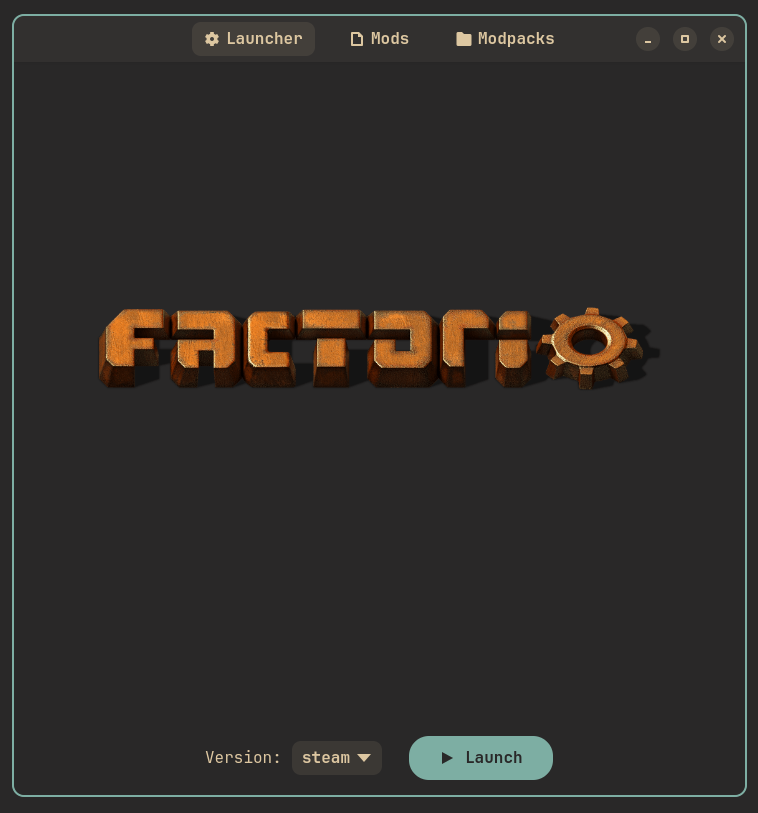

# WIP -- Only launcher is implemented now

## ProggerX/fmm -- Factorio Mod Manager + Launcher
### Description
fmm allows you to launch your Factorio instances (including steam one), manage mods and create modpacks in a simple yet fashionable GUI.

### Features / Roadmap
- ⚙️ Factorio instances, mods and modpacks management
- ⬇️ Built-in download for instances and mods from official APIs
- 🎨 Stylish GTK interface
- 🗂️ Transparent interaction with filesystem
- 🧑‍🤝‍🧑 Easy-to-share modpack format

### Screenshots

